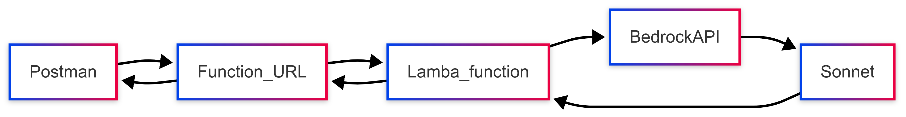
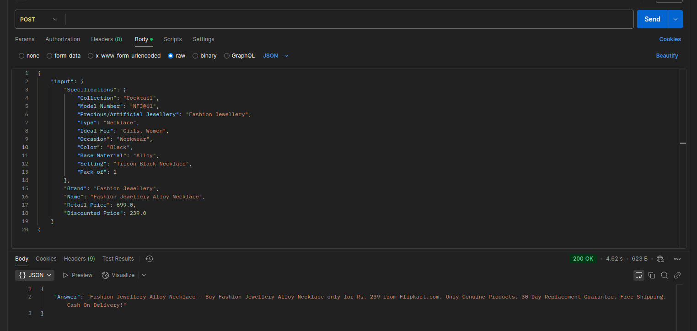

# Few-shot learning based Prompt engineering for Product description generation

## Summary

This projects applies few-shot prompt engineering while inferencing LLMs for dynamic product description generation. After some data transformation and cleaning, the prompts are constucted with Langchain for Llama and the MessagesAPI for Sonnet from Flipkart product specifications. 

The project has a full integration with AWS, and utilizes Sagemaker, Bedrock and an external Lambda API that can be called with Postman or curl. The model performance is evaluated and visualized with BERTscore, computed with a roberta-large embedding model.

---

### Dataset

The dataset is filtered to only contain samples that belong to "Jewellery >> Necklaces & Chains >> Necklaces" product_category_tree. It comes to 1500 different flipkart products.

- Flipkart Products: [kaggle.com/flipkart-products/](https://www.kaggle.com/datasets/PromptCloudHQ/flipkart-products/data/)

- Input: product_name, product_specifications, brand, retail and discounted prices

- Output: description


### Approach: few-shot learning for prompt construction

- Prompt construction with Langchain and MessageAPI

- Cloud: AWS - Tools: Bedrock, Sagemaker and Lambda

- LLMs: Llama LLM-3.1-8B model, Anthropic Claude Sonnet 3.5 v1

- Eval metrics: BERTScore (Precision, Recall, F1), computed with roberta-large



---

### Local notebook requirements

Install packages from the included requirements file:

    pip3 install -r requirements.txt


### Prerequisites for Sagemaker

For requirements, use the included environment in Sagemaker, and install bert_score package:

    pip install bert_score

Then, add your Hugging Face token to the environment (only for the token cost calculation):

    export HF_TOKEN="<YOUR_TOKEN>"

---

### Results

Sonnet 3.5 achieves 0.99 average BERT f1 score with only 3 few-shot examples, albeit with high output token costs and slow inference time.

---

### Lambda integration

For deploying a Lambda function, both the AWS Lambda Web UI and the AWS CLI can be used. The following are the necessary steps for setting up a Lambda Function with AWS CLI from a local terminal under Ubuntu. Files for inferencing Sonnet can be found under the lambda_files folder.

For debugging purposes, you can check the AWS CloudWatch logs.

#### Lambda function integration steps:

Install AWS command line -> [Official AWS documentation](https://docs.aws.amazon.com/cli/latest/userguide/getting-started-install.html).

Authenticate in a terminal with your credentials through one of the possible methods, for example:

    $ aws configure

    AWS Access Key ID [None]: YOUR_ACCESS_KEY
    AWS Secret Access Key [None]: YOUR_SECRET_ACCESS_KEY
    Default region name [None]: REGION_NAME
    Default output format [None]: json

Define a base IAM Role with a local json file which enables access to Lambda (using file:// is necessary):

    aws iam create-role --role-name ROLE_NAME --assume-role-policy-document file://POLICY_FILE.json

Policy file can be found under the lambda_files/lambda_policies folder.

Check your role details with:

    aws iam get-role --role-name ROLE_NAME

Prepare a zip file for handling requests:

    zip -r python.zip .

Create the Lambda function:

    aws lambda create-function --function-name FUNCTION_NAME --runtime RUNTIME --zip-file fileb://ZIP_FILE --handler lambda_function.handler --role ROLE_ARN

Optional: update your Lambda function with:

    aws lambda --update-function-code --handler HANDLER --zip-file fileb://ZIP_FILE

Optional: delete your Lambda function with:

    aws lambda delete-function --function-name FUNCTION_NAME

If your Lambda function needs access to additional packages, add them as Layers (example is under Python for the pandas package):

    mkdir ./python

    pip3 install -t ./python/ pandas

    aws lambda publish-layer-version --layer-name LAYER_NAME --zip-file fileb://pandas_dep.zip

    aws lambda update-function-configuration --function-name FUNCTION_NAME --cli-binary-format raw-in-base64-out --layers "LAYER_ARN_NAME"

Create Function URL (with your preferred authentication mode):

    aws lambda create-function-url-config --function-name FUNCTION_NAME --auth-type NONE 

Set permission for invoking Function URLs:

    aws lambda add-permission --function-name FUNCTION_NAME --statement-id "AllowPublicAccess" --action "lambda:InvokeFunctionUrl" --principal "*" --function-url-auth-type NONE

Update Lambda function configuration:

    aws lambda update-function-configuration --function-name FUNCTION_NAME --memory-size 248 --timeout 35

Add or create and attach an access policy to Bedrock (potentially can be stricter):

    aws iam create-policy --policy-name BedrockFullAccess --policy-document file://POLICY_FILE.json

    aws iam attach-role-policy --role-name ROLE_NAME --policy-arn arn:aws:iam::094132476816:policy/BedrockFullAccess

or

    aws lambda add-permission --function-name FUNCTION_NAME --source-arn arn:aws:iam::aws:policy/AmazonBedrockFullAccess

Policy file can be found under the lambda_files/lambda_policies folder.

Add Lambda Execution Role:

    aws iam attach-role-policy --role-name ROLE_NAME --policy-arn arn:aws:iam::aws:policy/service-role/AWSLambdaBasicExecutionRole

Check your policy with details:

    aws lambda get-function --function-name FUNCTION_NAME --query 'Configuration.Role' --output text

    aws lambda get-policy --function-name FUNCTION_NAME

Call your function with curl, Postman or through one of Lambda's built in function.

---

### Example

The input is structured as a json object:

```json
{
"input": {
    "Specifications": {
        "Collection": "Cocktail", 
        "Model Number": "NFJ@61", 
        "Precious/Artificial Jewellery": "Fashion Jewellery", 
        "Type": "Necklace", 
        "Ideal For": "Girls, Women", 
        "Occasion": "Workwear", 
        "Color": "Black", 
        "Base Material": "Alloy", 
        "Setting": "Tricon Black Necklace", 
        "Pack of": 1 
        }, 
    "Brand": "Fashion Jewellery", 
    "Name": "Fashion Jewellery Alloy Necklace", 
    "Retail Price": 699.0, 
    "Discounted Price": 239.0
    }
}
```

And the returned output is as such:

```json
{
    "Answer": "Fashion Jewellery Alloy Necklace - Buy Fashion Jewellery Alloy Necklace only for Rs. 239 from Flipkart.com. Only Genuine Products. 30 Day Replacement Guarantee. Free Shipping. Cash On Delivery!"
}
```

Example in Postman:



---

### Potential Improvements

- Using different example selectors
- Fine-tuning model hyperparameters
- Further data engineering

---
